A new set of APIs
=================

One of the important news happening with the Domino 10 launch is the
possibility to use the NodeJS programming model to interact with the
Domino 10 runtime.

As part of this evolution, our partner HCL has published

-   the **"App Dev Pack"**, which is the server-side component that
    allows a Domino 10 installation to support a new set of APIs and the
    new "Domino Query Language"

-   and the **"domino-db NPM"** component, which provides a NodeJS
    package that allows NodeJS developers to simply and easily create
    applications that make use of the features exposed by the **"App Dev
    Pack"**.

This article focuses on how a power user can, transparently, use the
**"domino-db NPM"** component by means of the new **Node-RED dominodb
package** (see this link
<https://flows.nodered.org/node/node-red-contrib-dominodb> for more
details). This new Node-RED package aims to provide a very simple and
programmer-friendly abstraction for the APIs exposed by the "**domino-db
NPM**" package in order to make it simple, even for not NodeJS experts,
to create integrations with Domino 10 with "very little" or "no
programming" skills.

The APIs exposed by the **"domino-db NPM"** component allow to perform
**CRUD operations** on a given Domino Database. Those APIs are described
in the README.md and Reference.md files included in the **"domino-db
NPM"** package. There are, roughly, 3 types of APIs:

-   APIs that work on "sets" of documents.\
    You can:

    -   Get a set of documents specified either by a DQL Query or by a
        list of unique Ids

    -   Replace a set of documents (or a set of items within the
        documents) specified either by a DQL Query or by a list of
        unique ids

    -   Delete a set of documents (or a set of items within the
        documents) specified either by a DQL Query or by a list of
        unique ids

    -   Create a set of documents

-   APIs that work on a single document.\
    You can Read, Replace, Delete or Create a document specified by its
    unique id

-   Service APIs.\
    These APIs allow you to connect to a Domino Server, to select a
    Domino database to work with, to get information about the
    connection that has been established.\
    An interesting Service API allows the programmer to **explain a DQL
    Query** before running it. It can become extremely useful when
    evaluating the optimal way to query a large Domino database.

The use of these APIs requires some familiarity with advanced Javascript
programming (promises, the new Async features of ES6, error management
etc).\
This may quickly become an obstacle for **power users** or for **Domino
programmers** who are more focused on the business logic and/or on the
data that need to be manipulated. Here is an example of the code
fragment that is required to create a single document using the new
APIs:

{width="5.699301181102363in"
height="4.502833552055993in"}

Introducing Node-RED
====================

Node-RED (https://nodered.org/), which crisply defines itself as
"*Flow-based programming for the Internet of Things*" is the tool that
we have used to abstract the use of the standard APIs.\
Roughly, we encapsulated the access to the standard APIs as Node-RED
nodes and we provided a simpler way to execute those APIs as part of a
"flow". Information about this new Node-RED package is available at this
link : <https://flows.nodered.org/node/node-red-contrib-dominodb> .\
Let's see the details.

### The Domino 10 Node-RED nodes

The **node-red-contrib-dominodb** Node-RED provides the following nodes:

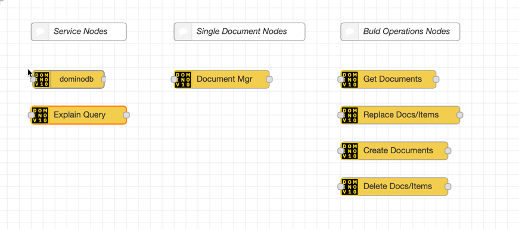{width="6.041666666666667in"
height="2.6666666666666665in"}

Each node implements all the code (and error management) to properly
connect to a Domino Server and to a selected Domino database; you, as
the creator of the Node-RED flow, simply need to select the right
instance of the **dominodb node** on which the node will act upon.

Most of the nodes encapsulate the use of more than one APIs, thus
allowing you to select which functional operation to execute instead
than spending your time in understanding which API (and which
parameters) to use.

The list of available nodes is shown under the **Domino 10** Category on
the left palette of the Node-RED\
editor, as shown here:

{width="6.5in" height="3.902083333333333in"}

This simple set of nodes can be used to quickly and safely access to,
virtually, all the APIs exposed by the "**domino-db NPM" component**.
The **"domino-db NPM" component** is a pre-requisite for the Node-RED
package and needs to be installed before the
**node-red-contrib-dominodb** Node-RED package is downloaded (please
refer to the *Installation section* of the package for details).

A detailed article explaining the behavior of this new Node-RED package
is available

**\<\<find the right wording\>\>**.

The new domino-db Node-RED nodes in action
==========================================

### Quickly Integrating with IBM Connections

Let's suppose that we have a Domino application which displays some
quotes. Each "quote record" has several attributes *("account-number"*,
*"customer"*, *"amount"*, *"total"*, *"part-number"* etc).

One of these properties (that we inherited from whoever designed our
Domino application) is *"seller*": this property holds the *"email
address"* of the seller who is responsible for that quote.

**We are asked to make our Domino application friendlier by displaying
the *"real name"* of the seller instead of her email address.**

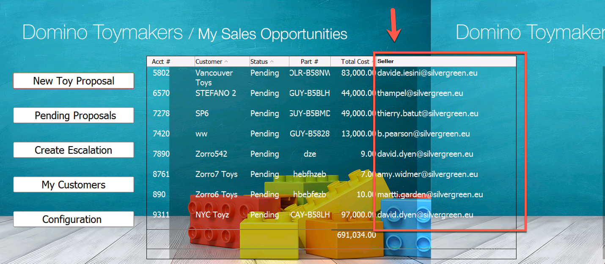{width="6.5in" height="2.8361111111111112in"}

It turns out that all the sellers are in my organization and that my
organization has deployed IBM Connections. The IBM Connections Profiles
module holds the information about each person in my organization: so,
it would be logical to think that I would use IBM Connections to get the
*"real name"* of the seller. But it would not be logical at all to
manually add the *"real name"* to each record, right

We have three possibilities to address this challenge:

-   We could use the new Domino 10 LotusScript HTTP classes to build an
    agent which, for each record, would go and fetch the *"real name"*
    from IBM Connections given the *"email address"*.

-   We could use the new **"domino-db NPM"** component and build a
    NodeJS application which would do the same but using the new APIs

-   We could use the new **Node-RED dominodb** package to quickly do
    this.

Obviously, in this article, we are going to choose the 3^rd^ option so
that we can show the power and simplicity of the new **Node-RED
dominodb** package.

We assume that you have a Node-RED instance up and running and that you
properly installed the **Node-RED dominodb** package as described in
**\<\<find the right wording\>\> .**

We also assume you have installed the **IBM Connections Node-RED
package** and configured it to access to your IBM Connections
organization.

##### Get the documents from Domino

Let's open Node-RED and create a new Flow.

We will use the Get Documents node to retrieve the information from
Domino:

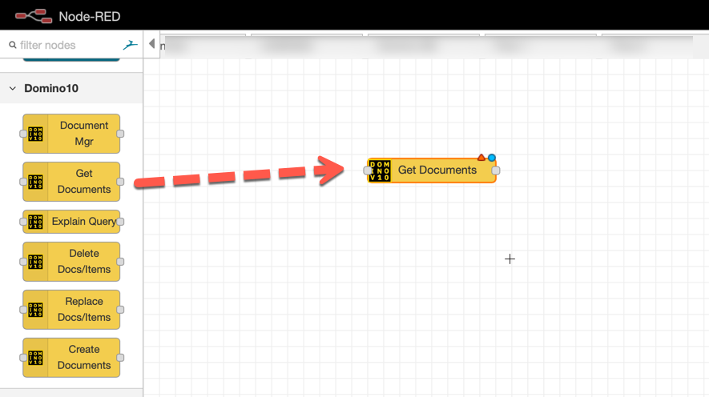{width="6.138888888888889in"
height="3.4444444444444446in"}

Let's open the **"Get Documents" node** in order to configure it.

The first thing we need to do is to create a connection to our Domino 10
server and to the Domino database holding our Quotes Application.

We click on the *pencil icon* associated to the Database item:\
\
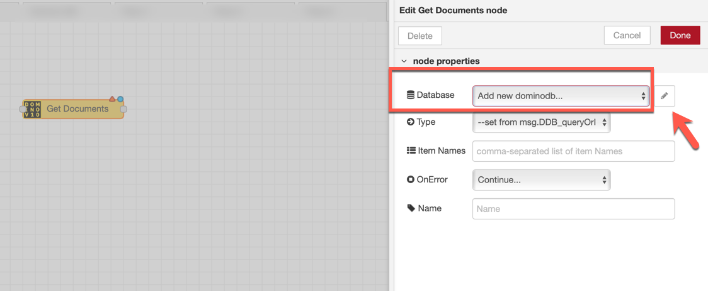{width="6.5in" height="2.683333333333333in"}

We enter the information that identify our Domino 10 server and the
Domino application Database.

We give a name to this configuration so that we can reuse it later.

We, then, click on the Add button to save the configuration:

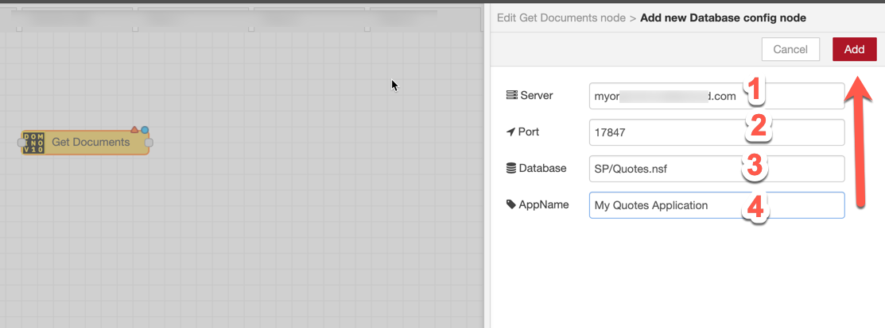{width="6.5in" height="2.420138888888889in"}

When we come back to our initial "Get Documents" node we can complete
the information as follows:

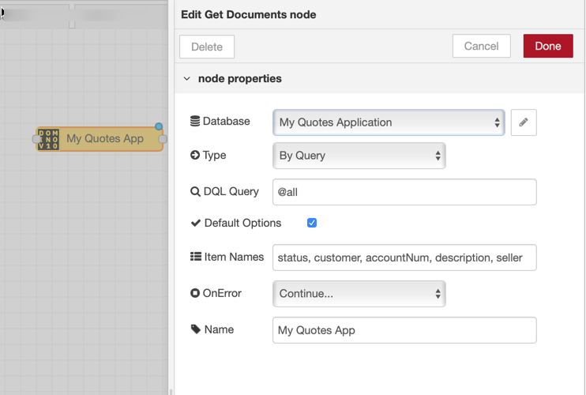{width="5.152777777777778in"
height="3.4722222222222223in"}

We have specified:

-   That we want to retrieve document via a DQL Query

-   The query is @all

-   That we want to retrieve the items status, customer, accountNum,
    description, seller

-   And that we want to name this node "My Quotes App"

We click the **Done button** and, then, we add an **Inject** and a
**Debug node** to test what we have done.

(Do not forget to hit the **Deploy button** to make your flow executable
!):

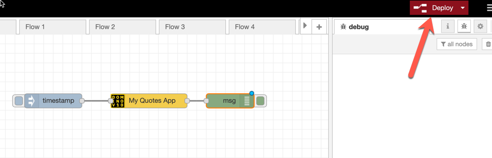{width="6.5in" height="2.0993055555555555in"}

Once you click on the **purple square** on the left of the **Inject
node**, you will see the results appearing in the Debug console on the
right:

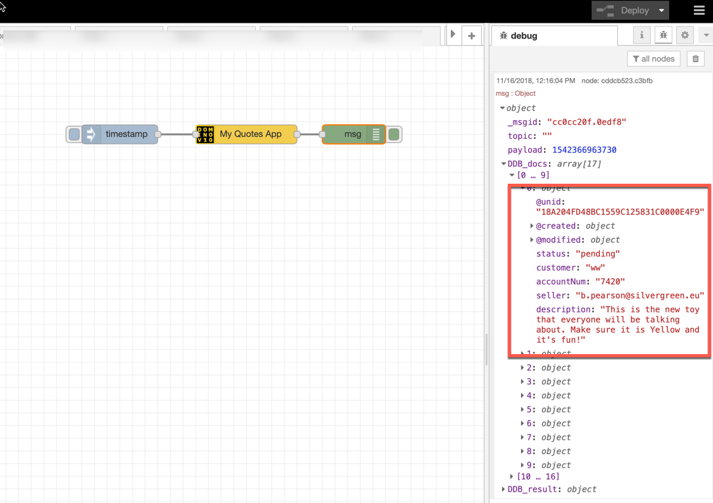{width="6.5in" height="4.583333333333333in"}

Now, we need to extract the seller information from each of the results
and to pass it to the Get Profiles node from the **IBM Connections
Node-RED package**.

##### Retrieve the information from IBM Connections

Let's modify our flow as follows:

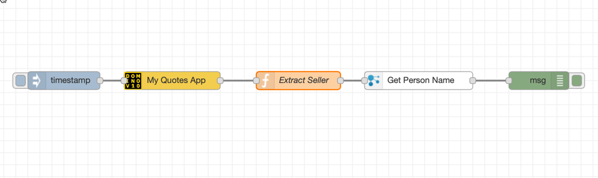{width="6.5in" height="1.9354166666666666in"}

We added a **Function Node** named *"Extract Seller"*.

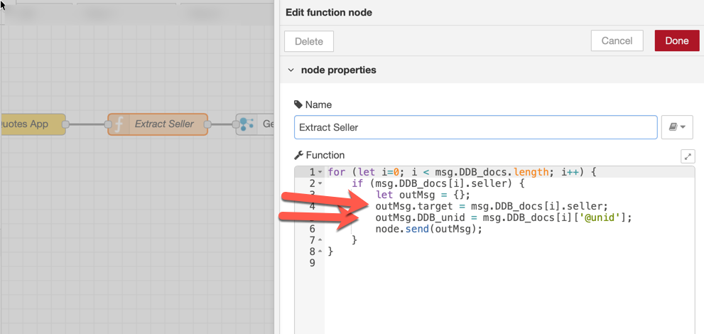{width="6.5in" height="3.0861111111111112in"}

This node contains a simple Javascript fragment to:

-   Extract the *seller* and *@unid* information from each of the
    results coming from the **"My Quotes App" node**

-   Create an object (outMsg) that will be passed to the IBM Connections
    **Get Profiles node**.\
    Actually the outMsg.DDB\_unid attribute is inserted in order for the
    Get Profiles node to transparently pass it further: we will need
    this information to update the Domino record later!

We also added an IBM Connections **Get Profile node** which is
configured in this way:\
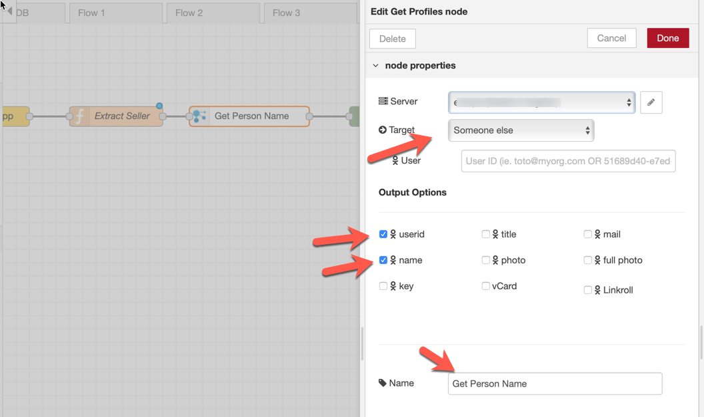{width="6.5in" height="3.8534722222222224in"}

This configuration, roughly, instruct the node:

-   To get information for *"somebody else"*. This *"somebody else"* is
    what is specified in the *target* attribute of the out message we
    built in the previous **"Extract Seller" node**

-   To retrieve the *userid* and *name* attribute from the IBM
    Connections server specified by the Server input in the
    configuration

So, at this point, we told:

-   To retrieve the records from the Domino application

-   To iterate through the results and, for each result, to retrieve the
    *name* and *userid* attributes from IBM Connections associated with
    the *seller* item in the relevant Domino document

Let's hit the **Deploy button** and execute again the flow (by clicking
on the **purple square** on the left of the Inject node). The results
will be shown here:

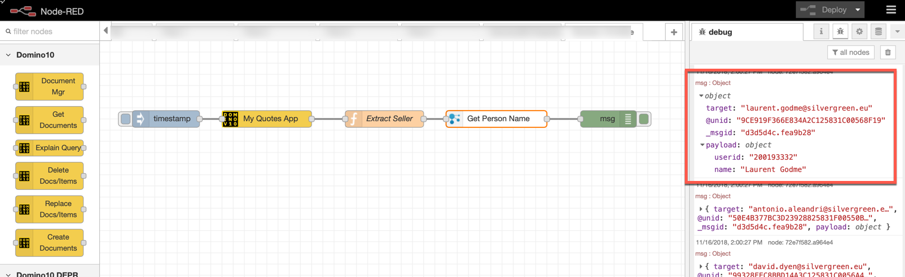{width="6.5in" height="1.9972222222222222in"}

For each *seller*, you will see a response from IBM Connections. The
response contains the *userid* and *name* attribute as we asked!

##### Update each Domino record

Now, we want to update each Domino record by adding a *Name* attribute
which contains the name of the *seller* as reported by IBM Connections.

Let's modify our flow in the following way:

{width="6.5in" height="1.554861111111111in"}

We added a **Function node** (named "*Extract Name*") which is
configured as follows:

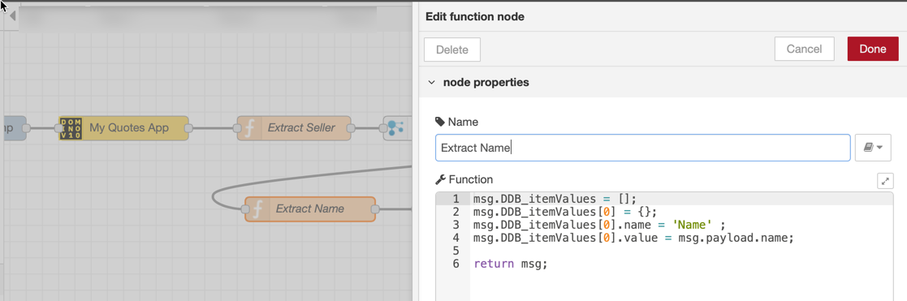{width="6.5in" height="2.154861111111111in"}

The msg.DDB\_itemValues adds the *Name* property (with a value coming
from the **Get Person Name node**).\
This information is passed to the "**add Name attribute" node** which is
configured as follows:

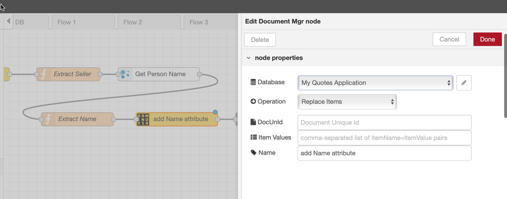{width="6.5in" height="2.5652777777777778in"}

This node gets the *Item Values* and the *DocUnid* values from the
output of the previous node (msg.DDB\_itemValues and msg.DDB\_unid) and
hides the complexity of using the **"domino-db NPM"** API directly!

Let's hit the **Deploy button** and execute again the flow (by clicking
on the **purple square** on the left of the **Inject node**). The
results will be shown here:

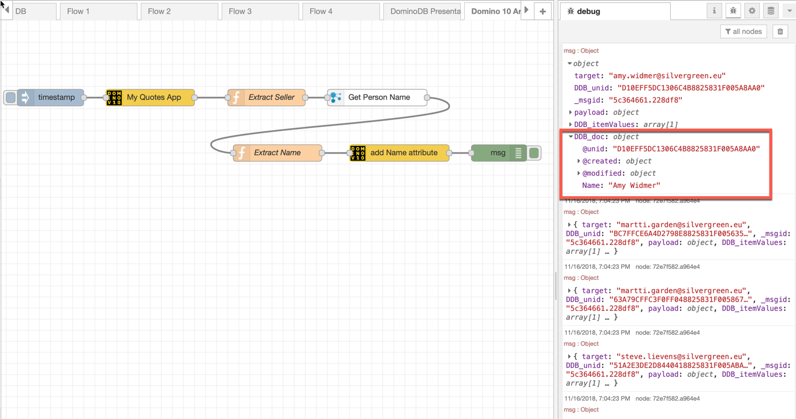{width="6.5in" height="3.422222222222222in"}

For each Document in the Domino database, we added the *Name* attribute.
The msg.DDB\_doc output attribute (highlighted in the above picture)
confirms that a new Name attribute was added to the Domino Document.

Note: we could have done the whole operation in Bulk, but this would
have made this simple example a little bit more complex and outside of
its scope.

Let's go and modify the form in the Domino Application to display the
modified records:

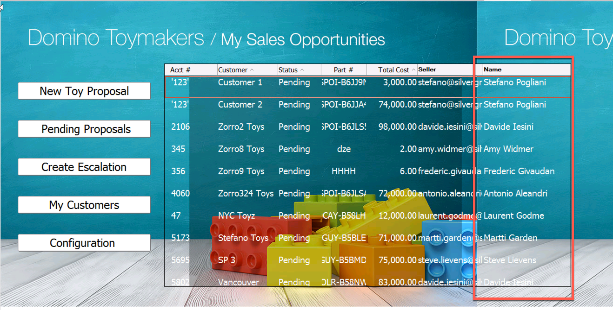{width="6.5in" height="3.2944444444444443in"}
