Table Of Contents
=================

[A new set of APIs](#a-new-set-of-apis)

[Introducing Node-RED](#introducing-node-red)

[The Domino 10 Node-RED nodes](#the-domino-10-node-red-nodes)

[The Configuration Node (dominodb)](#the-configuration-node-dominodb)

[Details of the dominodb Node-RED package](#details-of-the-dominodb-node-red-package)

[GetDocuments node](#getdocuments-node)

[Replace Documents / Items node](#replace-documents-items-node)

[Delete Documents / Items node](#delete-documents-items-node)

[Create Documents node](#create-documents-node)

[DocumentMgr node](#documentmgr-node)

[Explain Query node](#explain-query-node)

[Error Handling](#error-handling)

A new set of APIs
=================

One of the important news happening with the Domino 10 launch is the
possibility to use the NodeJS programming model to interact with the
Domino 10 runtime.

As part of this evolution, our partner HCL has published

-   the **"App Dev Pack"**, which is the server-side component that
    allows a Domino 10 installation to support a new set of APIs and the
    new "Domino Query Language"

-   and the **"domino-db NPM"** component, which provides a NodeJS
    package that allows NodeJS developers to simply and easily create
    applications that make use of the features exposed by the **"App Dev
    Pack"**.

It is not the goal of this article to drill in the details of how to
install and configure the "App Dev Pack". In what follows, we assume
that this server-side component is installed and functioning on your
Domino 10 server.

This article focuses on how a power user can, transparently, use the
**"domino-db NPM"** component by means of the new **Node-RED dominodb
package**. This new Node-RED package aims to provide a very simple and
programmer-friendly abstraction of the APIs exposed by the "**domino-db
NPM**" package in order to make it simple, even for not NodeJS experts,
to create integrations with Domino 10 with "very little" or "no
programming" skills.

The APIs exposed by the **"domino-db NPM"** component allow to perform
**CRUD operations** on a given Domino Database. Those APIs are described
in the README.md and Reference.md files included in the NPM package.
There are, roughly, 3 types of APIs:

-   APIs that work on "sets" of documents.\
    You can:

    -   Get a set of documents specified either by a DQL Query or by a
        list of unique Ids

    -   Replace a set of documents (or a set of items within the
        documents) specified either by a DQL Query or by a list of
        unique ids

    -   Delete a set of documents (or a set of items within the
        documents) specified either by a DQL Query or by a list of
        unique ids

    -   Create a set of documents

-   APIs that work on a single document.\
    You can Read, Replace, Delete or Create a document specified by its
    unique id

-   Service APIs.\
    These APIs allow you to connect to a Domino Server, to select a
    Domino database to work with, to get information about the
    connection that has been established.\
    An interesting Service API allows the programmer to **explain a DQL
    Query** before running it. It can become extremely useful when
    evaluating the optimal way to query a large Domino database.

The use of these APIs requires some familiarity with advanced Javascript
programming (promises, the new Async features of ES6, error management
etc.\
This may quickly become an obstacle for **power users** or for **Domino
programmers** who are more focused on the business logic and/or on the
data that need to be manipulated. Here is an example of the code
fragment that is required to create a single document using the new
APIs.

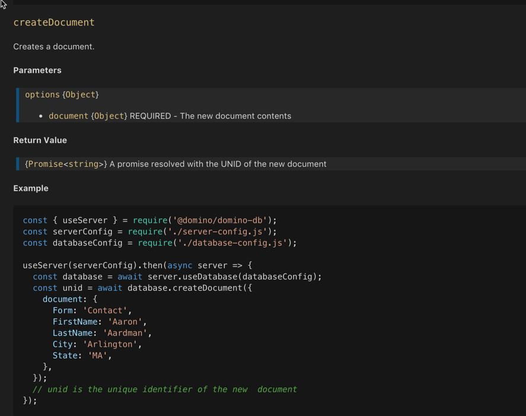

Introducing Node-RED
====================

Node-RED (https://nodered.org/), which crisply defines itself as
"*Flow-based programming for the Internet of Things*" is the tool that
we have used to abstract the use of the standard APIs.\
Roughly, we encapsulated the access to the standard APIs as Node-RED
nodes and we provided a simpler way to execute those APIs as part of a
"flow".\
Let's see the details.

### The Domino 10 Node-RED nodes

The **node-red-contrib-dominodb** Node-RED package
(https://flows.nodered.org/node/node-red-contrib-dominodb) provides the
following nodes:

Each node, by selecting an instance of the **dominodb node** (see
[here](#the-configuration-node-dominodb)), implements all the code (and
error management) to properly connect to a Domino Server and to a
selected Domino database; you, as the creator of the flow, simply need
to select the right instance of the **dominodb node** on which to act
upon.

Most of the nodes encapsulate the use of more than one APIs, thus
allowing you to select which functional operation to execute instead
than spending your time in understanding which API (and which
parameters) to use.

The list of available nodes is shown under the **Domino 10 Category** on
the left palette of the Node-RED\
editor, as shown here:

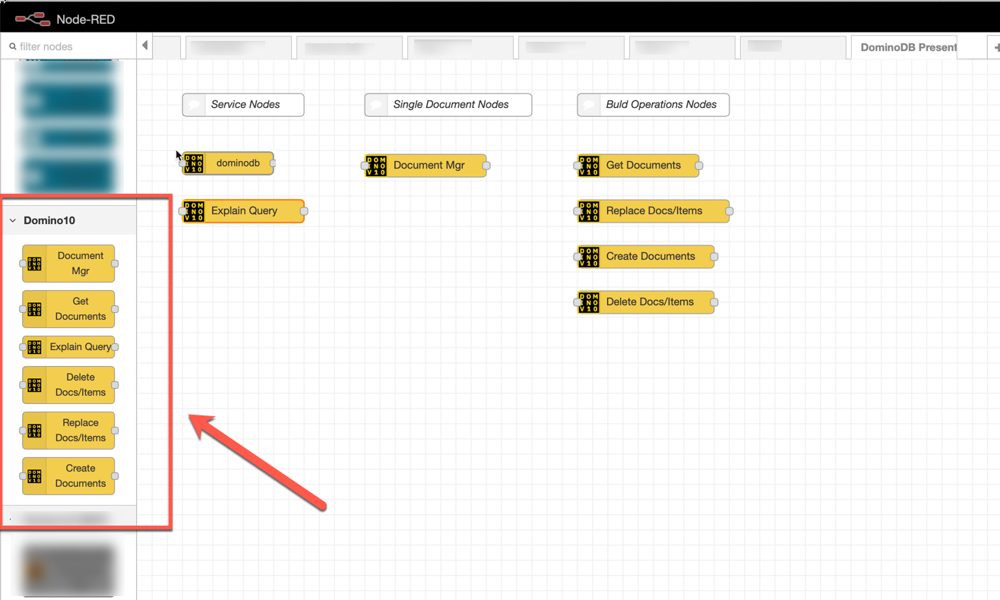

<strong><u>Note: </u></strong>

this article is based on the V 0.9.7 version of the **node-red-contrib-dominodb** package. \
This simple set of nodes can be used to quickly and safely access to,
virtually, all the APIs exposed by the "**domino-db NPM" component**.
The **"domino-db NPM" component** is a pre-requisite for the Node-RED
package and needs to be installed before the
**node-red-contrib-dominodb** Node-RED package (please refer to the
*Installation section* of the package for details).

<strong><u>Note: </u></strong>

In order to enable verbose logging for the nodes contained in the
**node-red-contrib-dominodb** package, you need to set the value of the
d10Debug environment variable to true.

### The Configuration Node (dominodb)

A special role is reserved to the **dominodb node**:
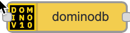\
This node (a *Configuration node*, in Node-RED parlance) defines a
configuration for the Domino Server and Domino Database that will be
used by all the other nodes.

Since this is a *Node-RED Configuration node*, you can save multiple
instances of the **dominodb node** configuration, allowing you to select
on which database your other nodes will act upon; for instance, you can
create several **dominodb Configuration nodes** to represent several
Domino databases (on the same Domino Server or on different servers).

##### Create a dominodb node

All the nodes in the **node-red-contrib-dominodb** package (they are all
described in the following "[Details of the dominodb Node-RED
package](#details-of-the-dominodb-node-red-package)" section), allow you
to select the **dominodb node** that will be used via the *Database
dropdown* selector:

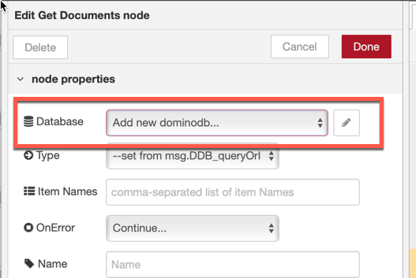

When you need to create a configuration for a new Domino Database on a
given server, you select, from the dropdown, the Add new dominodb...
option and you click on the pencil icon on its right.

This opens the editor for configuring a new connection:

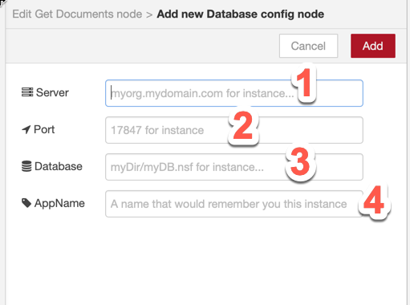

You need to provide the details for your server (1), the port (2) and
the location of the Domino Database you want to use (3).

We suggest adding a label (4) that will uniquely identify that Database
instance.

When you click on the *Add button*, your configuration will be created
and stored.

As mentioned above, you can have multiple **dominodb configuration
nodes** and they will all be available via the *Database dropdown
selector* for all other nodes in the package.

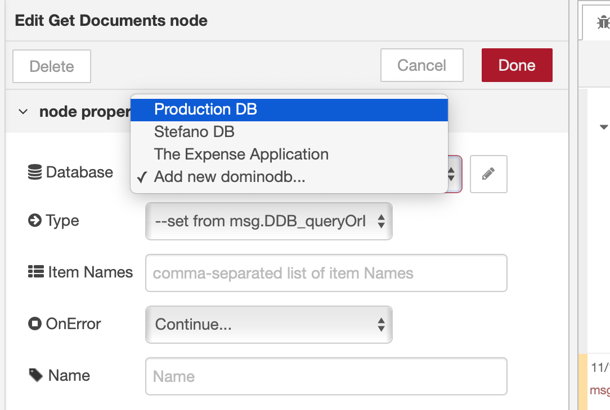

You can modify any previously created **dominodb configuration node** by
selecting it in the *Database dropdown selector* and clicking on the
pencil icon:

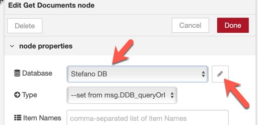

Details of the dominodb Node-RED package
========================================

In this section we provide the details associated to each of the
available nodes.

### GetDocuments node

A node that allows to retrieve documents from a Domino database.\
The node implements the bulkReadDocuments (to get a list of documents
using the **Domino Query
Language** [language](https://www-01.ibm.com/support/docview.wss?uid=ibm10729047))
and the bulkReadDocumentsByUnid (to get a list of documents by
their **unids**) APIs via the **Type selector** in the Configuration
Panel or via the msg.DDB\_queryOrId input parameter.

Clicking on the instance of the node, you can see the online help in the
rightmost panel of the Node-RED editor:\
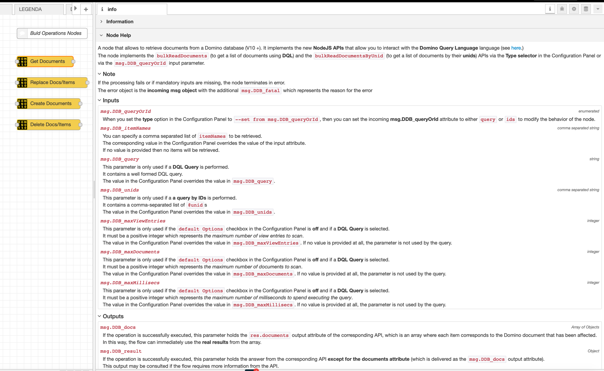

The help describes the behavior of the node as well as all the input and
output parameters for the node itself.

Selecting the Domino Server and Database\
You can select the instance of your Domino Database using the
*Application selector*:\
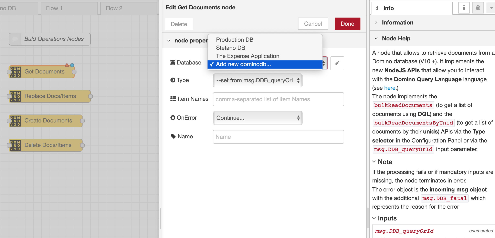\
This provides access to the library of **dominodb configurations**.

Selecting the operation\
By means of the *Type selector*, you can choose to retrieve the
documents identified by a **DQL Query** or by specifying the list of
Unique Ids associated to each document.\
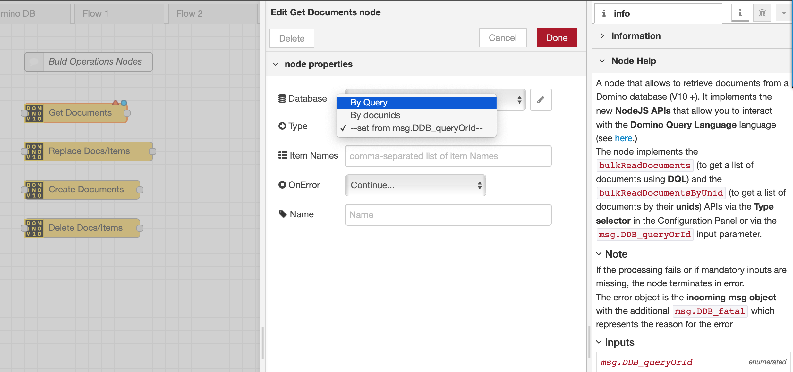\
\
It is, also, possible to configure the node to delegate to the incoming
msg.DDB\_queryOrIds attribute the kind of operation to be performed.
This is useful when, in your flow, you may want to decide which type of
operation to perform based on the information that the flow is managing.

-   In this case, you will also have to provide input attributes for the
    **DQL Query** string (as msg.DDB\_query) or for the list of Unique
    Ids (as msg.DDB\_unids)

DQL Query\
When selecting the **By Query option**, you can specify a valid **DQL
Query** (in the following picture 'nodejs'.status = 'pending' ) and the
list of items (in the following picture status, customer, description as
comma-separated items) to be retrieved.\
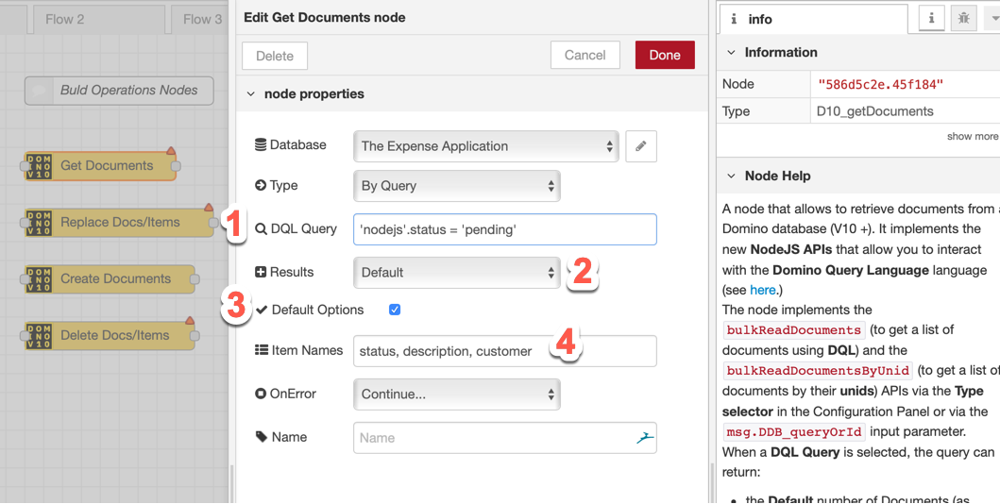

-   The *DQL Query input* can be left empty in the editor. You can use
    the msg.DDB\_query input attribute to provide the information at
    runtime.

-   The *Results selector* allows to define the documents that will be
    returned.\
    The possible values are:\
    

    -   ***Default***:\
        In this case the query will be executed without specifying any
        *start* and *count* parameters. Only those documents which match
        the default criteria (from index "0" to index "99") will be
        retrieved

    -   ***All Documents***\
        In this case all documents matching the query will be returned.\
        Be aware that this may be a huge number which may make your
        NodeRED environment getting out of Memory.

    -   ***By Page***\
        In this case, you will be asked to specify the *start* and
        *count* options in order to retrieve "**count documents starting
        at the start index**"

        -   The *start* and *count* parameters can also be specified by
            the incoming msg.DDB\_startValue and msg.DDB\_countValue.\
            The values in the configuration panel override the incoming
            values.

    -   ***---set from DDB\_displayResults\--***\
        The incoming msg.DDB\_displayResults can be used to provide the
        information at runtime. Valid values are "**Default**",
        "**All**" and "**byPage**".

-   In the above picture, we are using *Defaults Options* for the query.
    You can override them by unchecking the *Default Options checkbox*
    and specifying different values for the Max View Entries, Max
    Documents and Max Milliseconds parameters).\
    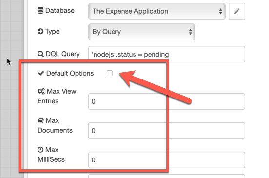

-   The *Item Names input* can be left empty in the editor. You can use
    the msg.DDB\_itemNames input attribute (which is, also, a
    comma-separated list of unique ids) to provide the information at
    runtime

Getting documents by Unique Ids\
When selecting the **By UniqueIds option**, you can specify the list of
Unique Ids (as comma-separated list of items) representing the documents
to be retrieved and the list of items (in the following picture status,
description, customer as comma-separated items) to be retrieved.\
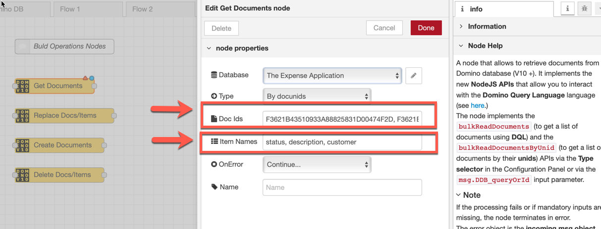

-   The *Doc Ids input* can be left empty in the editor. You can use the
    msg.DDB\_unids input attribute (which is, also, a comma-separated
    list of unique ids) to provide the information at runtime

-   The *Item Names* input can be left empty in the editor. You can use
    the msg.DDB\_itemNames input attribute (which is, also, a
    comma-separated list of unique ids) to provide the information at
    runtime

##### Controlling the behavior and appearance of your instance

-   You can specify the behavior of the API in case of error\
    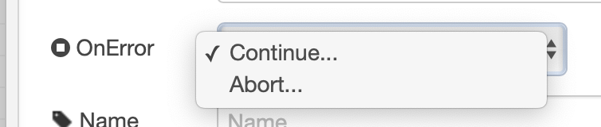

-   Do not forget to give a meaningful name to your newly created node\
    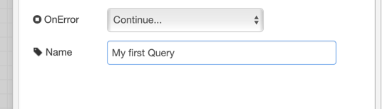

##### Output

If the execution of the node successfully completes, the following
outputs will be provided:

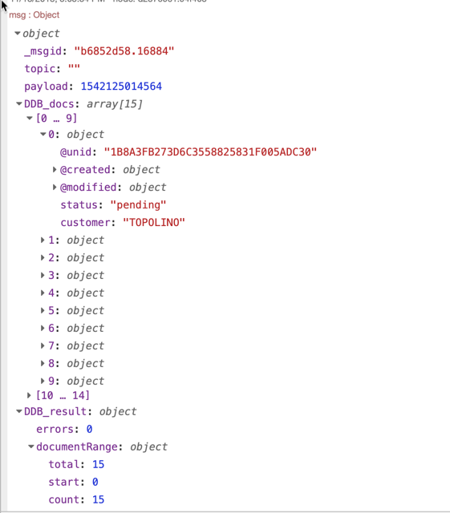

The DDB\_docs array provides a list of Objects which include the values
of the items you specified for your request.

The DDB\_result object contains the additional outputs provided by the
API, including the total number of documents matching the query, the
start index and the count value.\
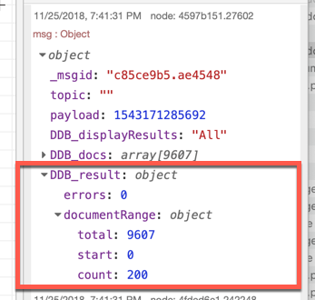

### Replace Documents / Items node

> A node that allows to replace **documents** or **items** from a Domino
> database (V10 +). It implements the new **NodeJS APIs** that allow you
> to interact with the **Domino Query
> Language** [language](https://www-01.ibm.com/support/docview.wss?uid=ibm10729047).\
> The node implements the following APIs:

-   bulKRreplaceDocumentsByUnid API \
    to replace a list of Documents specified by a **list of unids**

-   bulkReplaceItems API \
    to replace a list of Items from the Documents retrieved by a **DQL
    Query**

-   bulkReplaceDocumentsByUnid API \
    to replace a list of Items from the Documents specified by a **list
    of unids**

Clicking on the instance of the node, you can see the online help in the
rightmost panel of the Node-RED editor:\
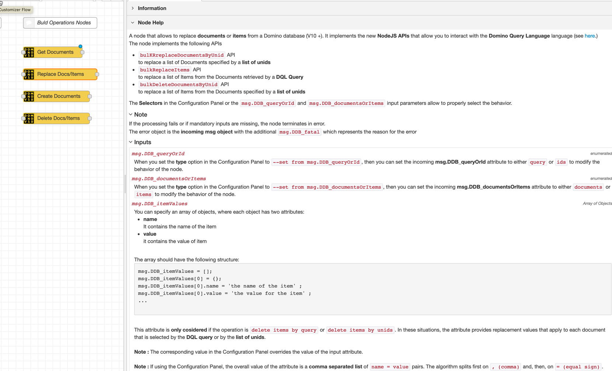

Selecting the Domino Server and Database\
You can select the instance of your Domino Database using the
*Application selector*:\
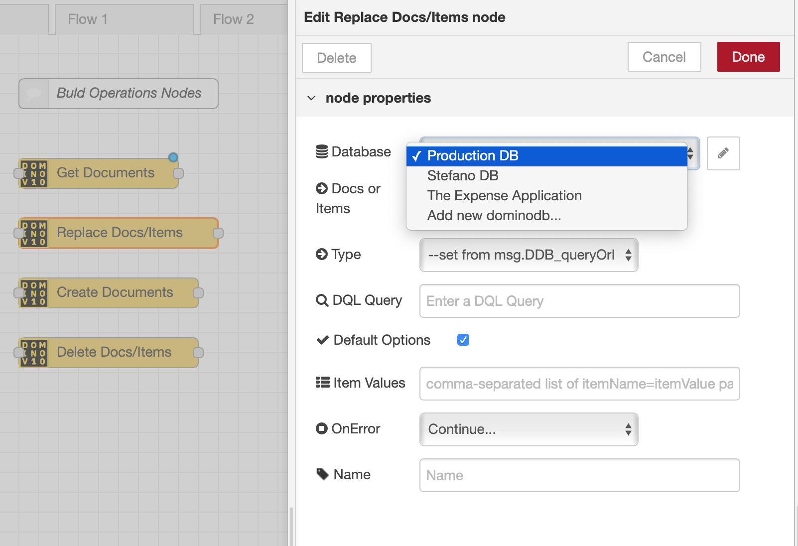\
This provides access to the library of **dominodb configurations**.

Selecting the target\
By means of the Docs or Items selector, you can choose to replace entire
documents or the value of certain items within the selected documents.\
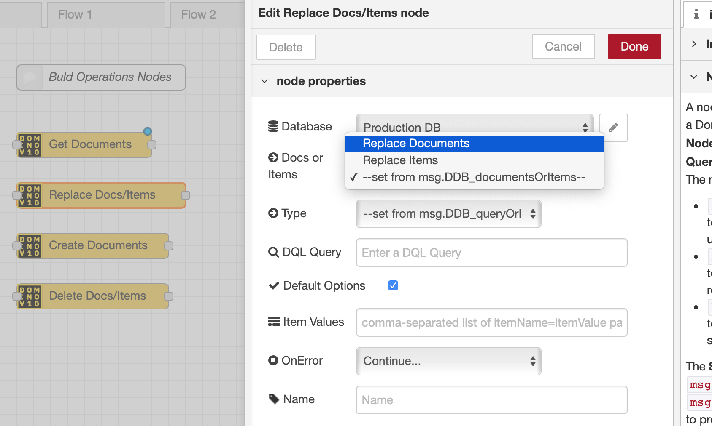\
\
It is, also, possible to configure the node to delegate to the incoming
msg.DDB\_documentsOrItems attribute the kind of operation to be
performed. This is useful when, in your flow, you may want to decide
which type of operation to perform based on the information that the
flow is managing.

-   In this case, you will also have to provide input attributes for the
    **DQL Query** string (as msg.DDB\_query) or for the list of Unique
    Ids (as msg.DDB\_itemValuesById, see later).

Selecting the operation\
By means of the *Type selector*, you can choose to replace the documents
identified by a **DQL Query** or by the list of Unique Ids associated to
each document.\
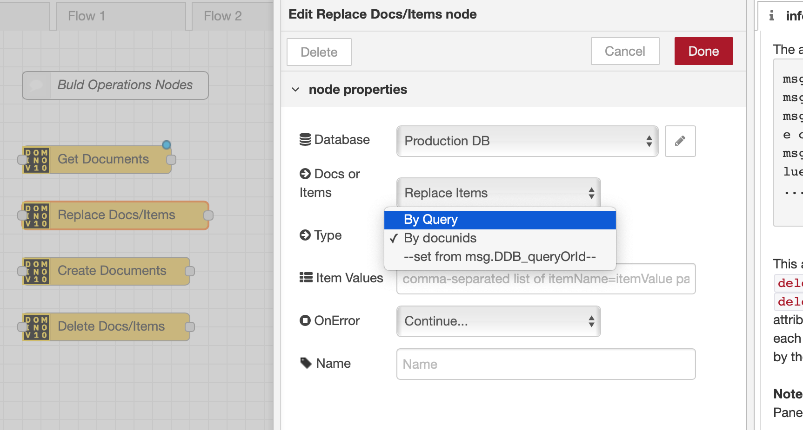\
\
It is, also, possible to configure the node to delegate to the incoming
msg.DDB\_queryOrIds attribute the kind of operation to be performed.
This is useful when, in your flow, you may want to decide which type of
operation to perform based on the information that the flow is managing.

-   In this case, you will also have to provide input attributes for the
    **DQL Query** string (as msg.DDB\_query) or for the list of Unique
    Ids (as msg.DDB\_itemValuesById, see later).

<strong><u>Note: </u></strong>

This *Type Selector* is only shown if you selected **Replace Items**
from the previous selector.\

In case you selected **Replace Documents**, the **DQL Query** option is
not currently supported by the APIs.

##### Replacing Documents

If you elected to replace entire documents, you will see the following
panel:

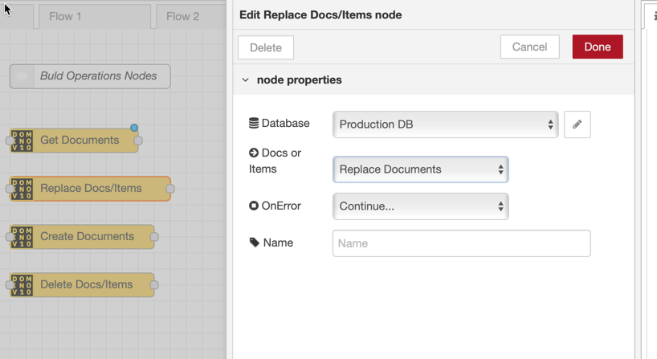

Apparently, you cannot specify which Documents you actually want to
replace. This is normal.\
Actually, the API that will be used when you elected to be in this
situation is the bulkReplaceDocumentsByUnid API. This API accepts an
array of objects, where each object holds the @unid attribute in
addition to the name and values of the other items that will be assigned
to the new Domino documents that will replace the old ones.\
It is not really simple to write a complex array of JSON objects in an
input text. So, the msg.DDB\_itemValuesById input attribute will be
used.

Here below is a simple example of how this attribute can be built by a
**Function Node** and passed to **the Replace Doc/Items node**.

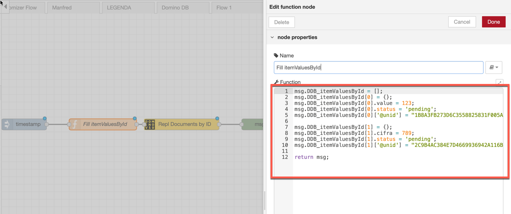

##### Replacing Items by Query

If you want to replace items within documents by specifying a **DQL
Query**, you will see the following panel:

You can specify a valid **DQL Query** (in the above picture
'nodejs'.status = 'pending' ) and a comma-separated list of
**itemName=itemValue** pairs (in the above picture customer=Mickey,
amount=123). The comma-separated list of **itemName=itemValue** pairs
contains the items that will be replaced for all Documents matching the
DQL query.

-   The *DQL Query input* can be left empty in the editor. You can use
    the msg.DDB\_query input attribute to provide the information at
    runtime.

-   The *Results selector* allows to define the documents that will be
    replaced.\
    The possible values are:\
    

    -   ***Default***:\
        In this case the query will be executed without specifying any
        *start* and *count* parameters. Only those documents which match
        the default criteria (from index "0" to index "99") will be
        replaced

    -   ***All Documents***\
        In this case the items for all the documents matching the query
        will be replaced.\
        Be aware that this may be a huge number which may make your
        NodeRED environment getting out of Memory.

    -   ***By Page***\
        In this case, you will be asked to specify the *start* and
        *count* options in order to replace "**count documents starting
        at the start index**"

        -   The *start* and *count* parameters can also be specified by
            the incoming msg.DDB\_startValue and msg.DDB\_countValue.\
            The values in the configuration panel override the incoming
            values.

    -   ***---set from DDB\_displayResults\--***\
        The incoming msg.DDB\_displayResults can be used to provide the
        information at runtime. Valid values are "**Default**",
        "**All**" and "**byPage**".

-   In the above picture, we are using *Defaults Options* for the query.
    You can override them by unchecking the *Default Options checkbox*
    and specifying different values for the Max View Entries, Max
    Documents and Max Milliseconds parameters).\
    

-   The *Item Values input* can be left empty in the editor. You can use
    the msg.DDB\_itemValues input attribute (which is an array of JSON
    objects formatted in the following way:\
    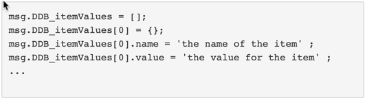

##### Replacing Items by Unique Ids

If you want to replace items within documents by specifying a list of
**unique Ids**, you will see the following panel:

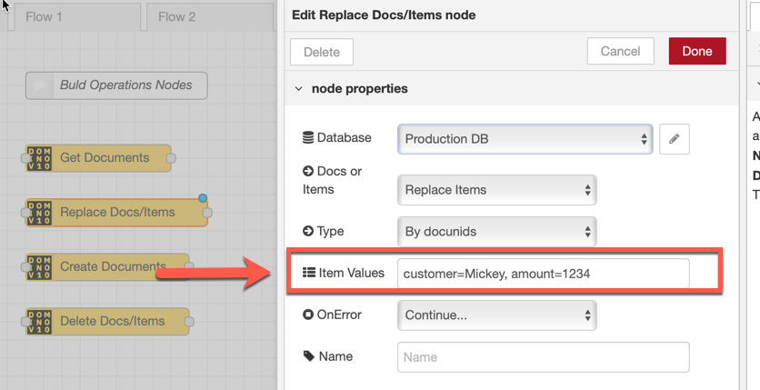

You can specify a comma-separated list of **itemName=itemValue** pairs
(in the above picture customer=MICKEY, amount=123).\
The *Item Values input* field defines the changed attributes that will
apply to all the selected documents.

-   The *Item Values input* can be left empty in the editor. You can use
    the msg.DDB\_itemValues input attribute (which is an array of JSON
    objects formatted in the following way:\
    

In order to provide the list of unique ids for replacing the items, we
need to go back to the API used in this situation, which is the
bulkReplaceItemsByUnid API. This API accepts, among other parameters, an
array of objects, where each object holds the @unid attribute in
addition to the name and values of the other items that will be assigned
to the new Domino documents that will replace the old ones.\
It is not really simple to write a complex array of JSON objects in an
input text. So, the msg.DDB\_itemValuesById input attribute will be
used.

Here below is a simple example of how this attribute can be built by a
**Function Node** and passed to **the Replace Doc/Items node**.

##### 

##### Controlling the behavior and appearance of your instance

-   You can specify the behavior of the API in case of error\
    

-   Do not forget to give a meaningful name to your newly created node\
    

##### Output

If the execution of the node successfully completes, the following
outputs will be provided:

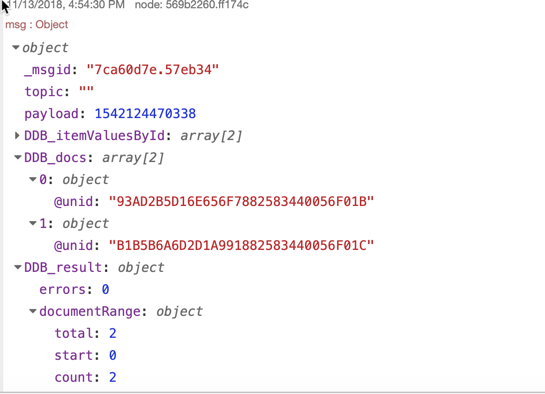

The DDB\_docs array provides a list of Unique Ids representing the
documents that have been deleted or the items of which have been
deleted.

The DDB\_result object contains the additional outputs provided by the
API, including the total number of documents matching the query, the
start index and the count value.\

### Delete Documents / Items node

A node that allows to delete **documents** or **items** from a Domino
database (V10 +). It implements the new **NodeJS APIs** that allow you
to interact with the **Domino Query
Language** [language](https://www-01.ibm.com/support/docview.wss?uid=ibm10729047).\
The node implements the following APIs

-   bulkDeleteDocuments API \
    > to delete a list of Documents retrieved by a **DQL Query**

-   bulkDeleteDocumentsByUnid API \
    > to delete a list of Documents specified by a **list of unids**

-   bulkDeleteItems API \
    > to delete a list of Items from the Documents retrieved by a **DQL
    > Query**

-   bulkDeleteDocumentsByUnid API \
    > to delete a list of Items from the Documents specified by a **list
    > of unids**

Clicking on the instance of the node, you can see the online help in the
rightmost panel of the Node-RED editor:\
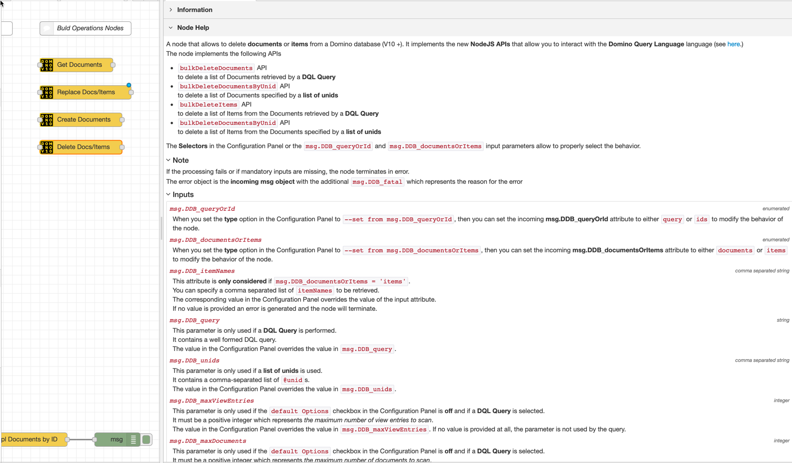

Selecting the Domino Server and Database\
You can select the instance of your Domino Database using the
*Application selector*:\
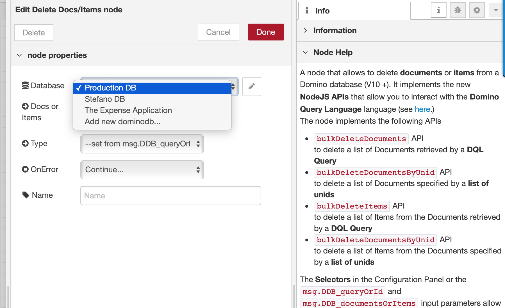\
This provides access to the library of **dominodb configurations**.

Selecting the target\
By means of the Docs or Items selector, you can choose to delete entire
documents or the value of certain items within the selected documents.\
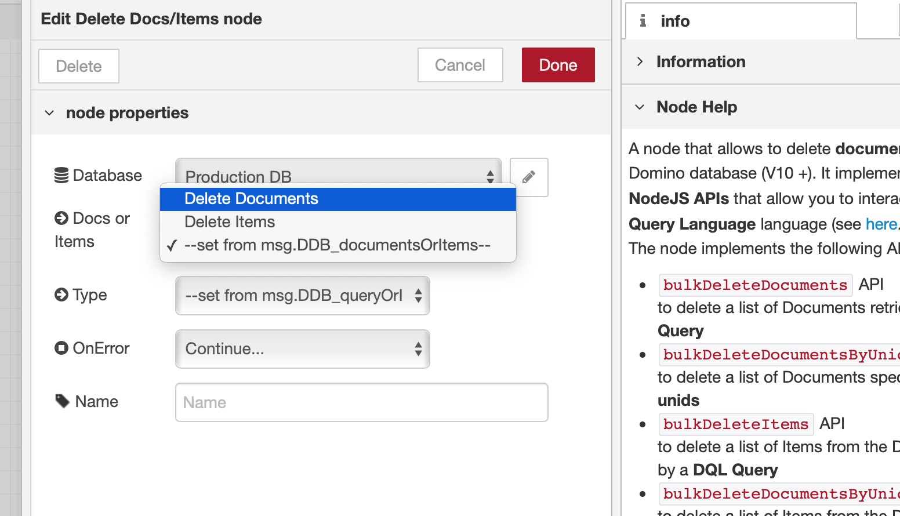\
\
It is, also, possible to configure the node to delegate to the incoming
msg.DDB\_documentsOrItems attribute the kind of operation to be
performed. This is useful when, in your flow, you may want to decide
which type of operation to perform based on the information that the
flow is managing.

Selecting the operation\
By means of the *Type selector*, you can choose to delete the documents
identified by a **DQL Query** or by the list of Unique Ids associated to
each document.\
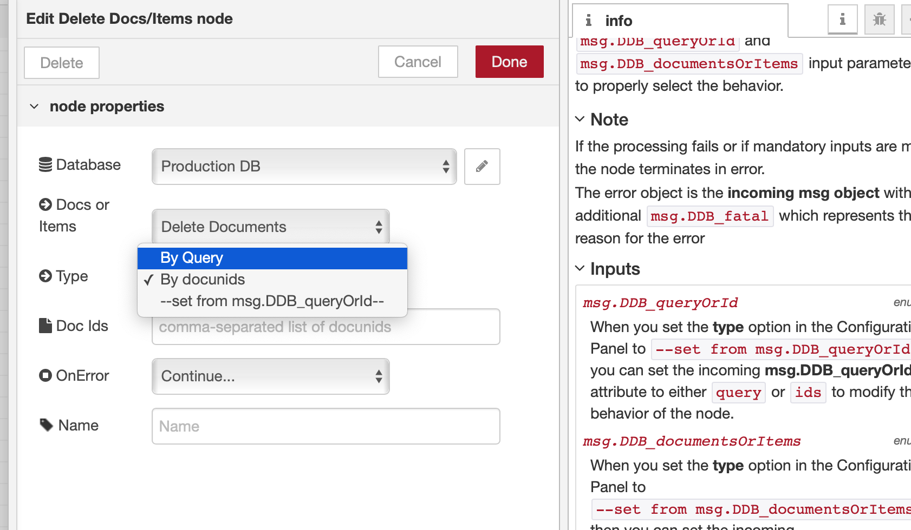\
\
It is, also, possible to configure the node to delegate to the incoming
msg.DDB\_queryOrIds attribute the kind of operation to be performed.
This is useful when, in your flow, you may want to decide which type of
operation to perform based on the information that the flow is managing.

-   In this case, you will also have to provide input attributes for the
    **DQL Query** string (as msg.DDB\_query) or for the list of Unique
    Ids (as msg.DDB\_unids, see later).

##### Deleting Documents by Query

If you elected to delete entire documents by Query, you will see the
following panel:

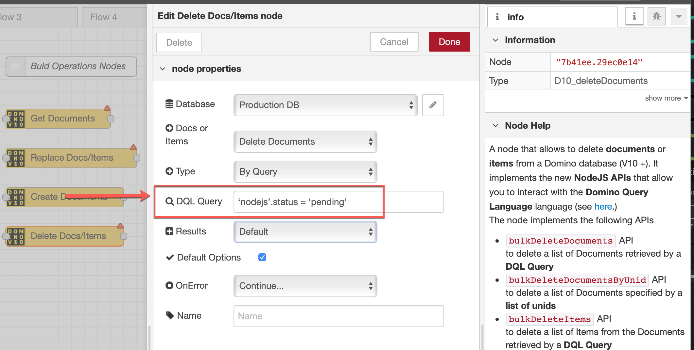

##### You can specify a valid **DQL Query** (in the above picture 'nodejs'.status = 'pending' ). 

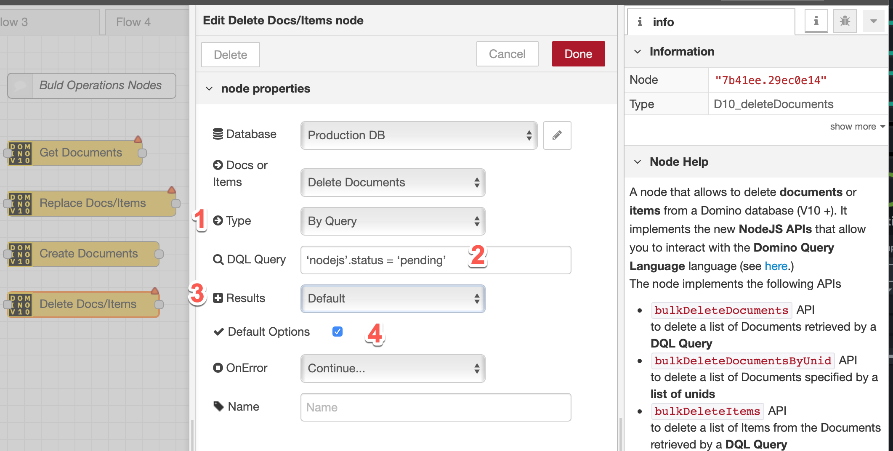

In the above picture,

-   The *DQL Query input* can be left empty in the editor. You can use
    the msg.DDB\_query input attribute to provide the information at
    runtime.

-   The *Results selector* allows to define the documents that will be
    deleted.\
    The possible values are:\
    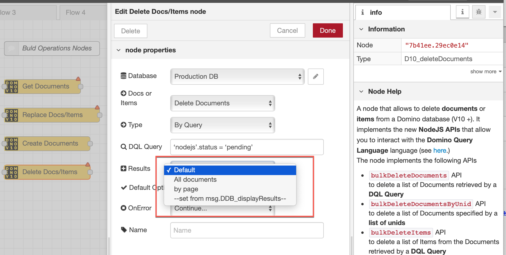

    -   ***Default***:\
        In this case the query will be executed without specifying any
        *start* and *count* parameters. Only those documents which match
        the default criteria (from index "0" to index "99") will be
        deleted

    -   ***All Documents***\
        In this case the items for all the documents matching the query
        will be deleted.\
        Be aware that this may be a huge number which may make your
        NodeRED environment getting out of Memory.

    -   ***By Page***\
        In this case, you will be asked to specify the *start* and
        *count* options in order to delete "**count documents starting
        at the start index**"

        -   The *start* and *count* parameters can also be specified by
            the incoming msg.DDB\_startValue and msg.DDB\_countValue.\
            The values in the configuration panel override the incoming
            values.

    -   ***---set from DDB\_displayResults\--***\
        The incoming msg.DDB\_displayResults can be used to provide the
        information at runtime. Valid values are "**Default**",
        "**All**" and "**byPage**".

-   we are using *Defaults* for the query. You can override them by
    unchecking the *Default Options checkbox* and specifying different
    values for the Max View Entries, Max Documents and Max Milliseconds
    parameters).\
    

##### 

##### Deleting Documents by ID

If you elected to delete entire documents by Query, you will see the
following panel:

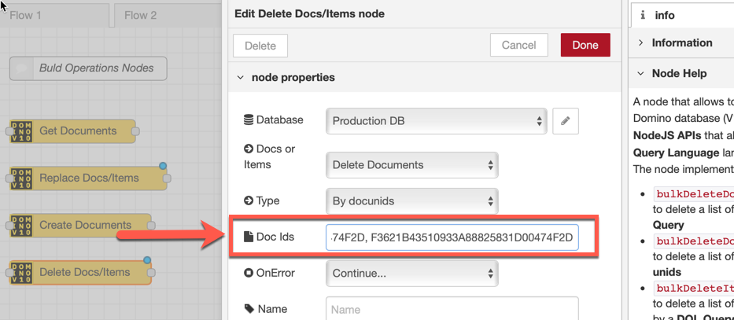 You can specify a comma-separated list of **unique Ids** (in the above picture F3621B43510933A88825831D00474F2D, E2510A3A32409822F77714720C99363E1C).

-   The *Doc Ids input* can be left empty in the editor. You can use the
    msg.DDB\_unids input attribute (which is, also, a comma-separated
    list of unique ids) to provide the information at runtime

##### Deleting Items by Query

If you want to delete items within documents by specifying a **DQL
Query**, you will see the following panel:

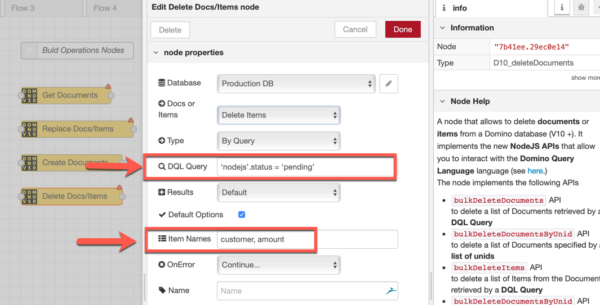

You can specify a valid **DQL Query** (in the above picture
'nodejs'.status = 'pending' ) and a comma-separated list of item names
(in the above picture customer, amount). The *Item Names input* field
defines the items that will be removed from the selected documents.

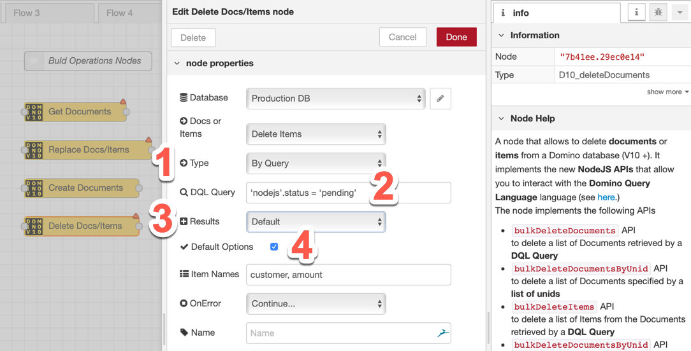

In the above picture:

-   The *DQL Query input* can be left empty in the editor. You can use
    the msg.DDB\_query input attribute to provide the information at
    runtime.

-   The *Results selector* allows to define the documents that will be
    deleted.\
    The possible values are:\
    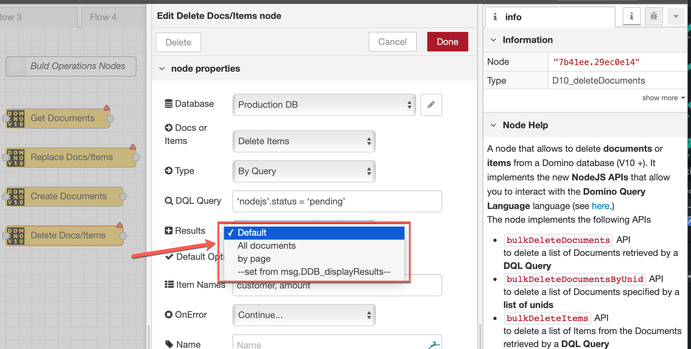

    -   ***Default***:\
        In this case the query will be executed without specifying any
        *start* and *count* parameters. The specified items for those
        documents which match the default criteria (from index "0" to
        index "99") will be deleted

    -   ***All Documents***\
        In this case the items for all the documents matching the query
        will be deleted.\
        Be aware that this may be a huge number which may make your
        NodeRED environment getting out of Memory.

    -   ***By Page***\
        In this case, you will be asked to specify the *start* and
        *count* options in order to delete the specified items for
        "**count documents starting at the start index**"

        -   The *start* and *count* parameters can also be specified by
            the incoming msg.DDB\_startValue and msg.DDB\_countValue.\
            The values in the configuration panel override the incoming
            values.

    -   ***---set from DDB\_displayResults\--***\
        The incoming msg.DDB\_displayResults can be used to provide the
        information at runtime. Valid values are "**Default**",
        "**All**" and "**byPage**".

-   we are using *Defaults* for the query. You can override them by
    unchecking the *Default Options checkbox* and specifying different
    values for the Max View Entries, Max Documents and Max Milliseconds
    parameters).\
    

-   The *Item Names input* can be left empty in the editor. You can use
    the msg.DDB\_itemNames input attribute (which is a comma-separeted
    list of item names).

##### Deleting Items by Unique Ids

If you want to replace items within documents by specifying a list of
**unique ids**, you will see the following panel:

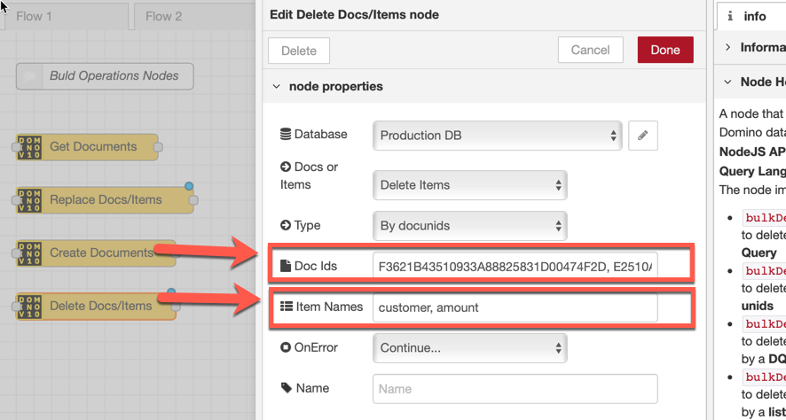

You can specify a comma-separated list of **unique Ids** (in the above
picture F3621B43510933A88825831D00474F2D,
E2510A3A32409822F77714720C99363E1C) and a comma-separated list of item
names (in the above picture customer, amount).\
The *Item Names input* field defines the items that will be removed from
the selected documents.

-   The *Doc Ids input* can be left empty in the editor. You can use the
    msg.DDB\_unids input attribute (which is, also, a comma-separated
    list of unique ids) to provide the information at runtime

-   The *Item Names input* can be left empty in the editor. You can use
    the msg.DDB\_itemNames input attribute (which is a comma-separeted
    list of item names).

##### 

##### Controlling the behavior and appearance of your instance

-   You can specify the behavior of the API in case of error\
    

-   Do not forget to give a meaningful name to your newly created node\
    

##### Output

If the execution of the node successfully completes, the following
outputs will be provided:

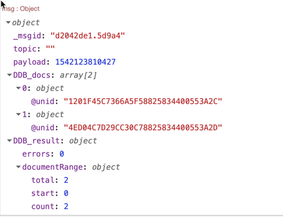

The DDB\_docs array provides a list of Unique Ids representing the
documents that have been deleted or the items of which have been
deleted.

The DDB\_result object contains the additional outputs provided by the
API, including the total number of documents matching the query, the
start index and the count value.\

### Create Documents node

A node that allows to create several **documents** in a Domino database
(V10 +). It implements the new **NodeJS APIs** that allow you to
interact with the **Domino Query
Language** [language](https://www-01.ibm.com/support/docview.wss?uid=ibm10729047). \
The node implements the bulkCreateDocuments API to create a list of
Documents.

Clicking on the instance of the node, you can see the online help in the
rightmost panel of the Node-RED editor:\
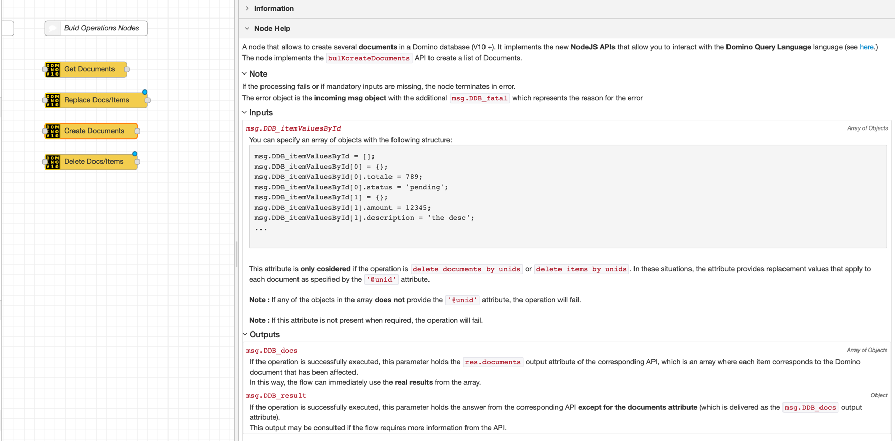

Selecting the Domino Server and Database\
You can select the instance of your Domino Database using the
*Application selector*:\
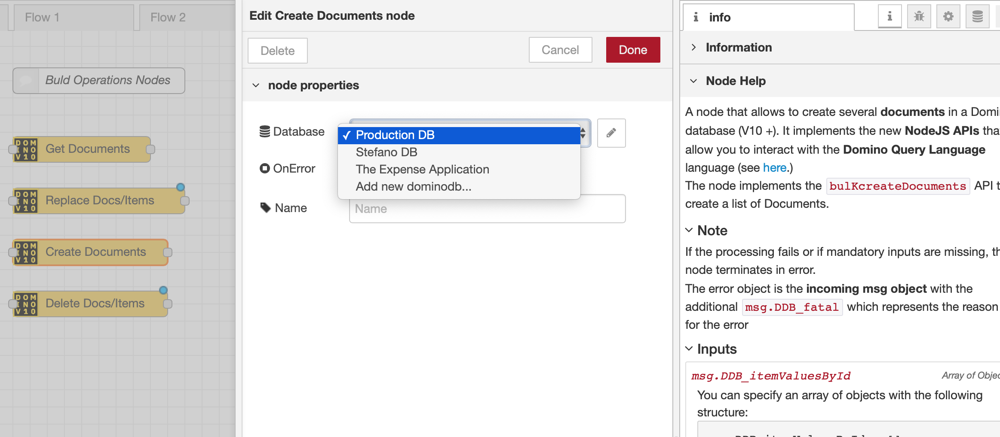\
This provides access to the library of **dominodb configurations**.

This node is very simple to use.\
In order to provide information for creating the new documents, we need
to go back to the API used in this situation, which is the
bulkCreateDocuments API. This API accepts, among other parameters, an
array of objects, where each object holds the name and values of the
items that will be assigned to the new Domino documents that will be
created.\
It is not really simple to write a complex array of JSON objects in an
input text. So, the msg.DDB\_itemValuesById input attribute will be
used.

Here below is a simple example of how this attribute can be built by a
**Function Node** and passed to **the Replace Doc/Items node**.

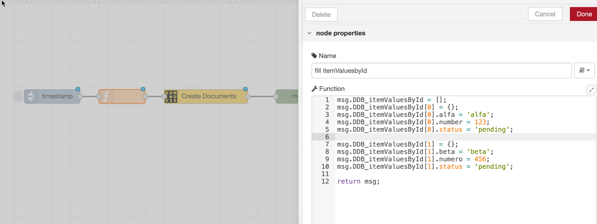{

##### Controlling the behavior and appearance of your instance

-   You can specify the behavior of the API in case of error\
    

-   Do not forget to give a meaningful name to your newly created node\
    

##### Output

If the execution of the node successfully completes, the following
outputs will be provided:

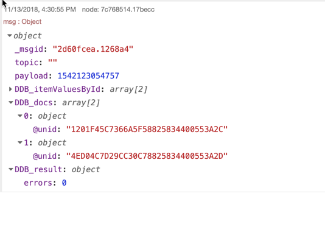

The DDB\_docs array provides a list of Unique Ids representing the
documents that have been created.

The DDB\_result object contains the additional outputs provided by the
API.

### DocumentMgr node

A node that allows to perform CRUD operations on a **Single
Document** in a Domino database. \
This module implements the following new **NodeJS APIs**

-   useDocument

-   read

-   createDocument

-   replace

-   replaceItems

-   delete

-   deleteItems

Clicking on the instance of the node, you can see the online help in the
rightmost panel of the Node-RED editor:\
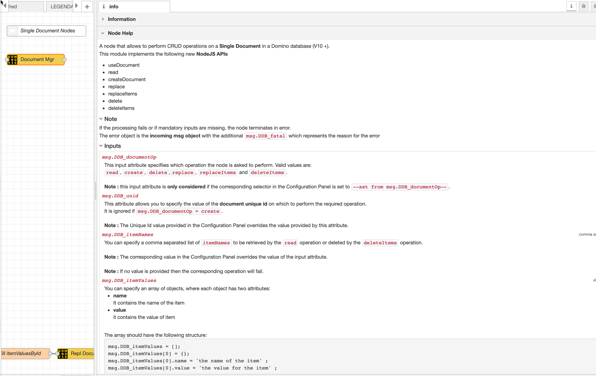

The help describes the behavior of the node as well as all the input and
output parameters for the node itself.

Selecting the Domino Server and Database\
You can select the instance of your Domino Database using the
*Application selector*:\
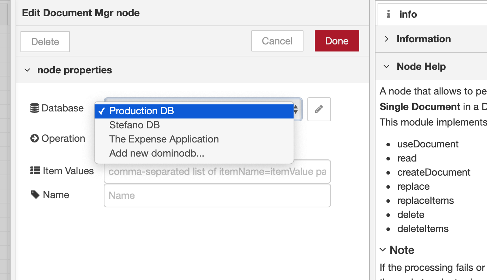\
This provides access to the library of **dominodb configurations**.

Selecting the operation\
By means of the *Operation selector*, you can choose which operation you
want to perform on a given Document.

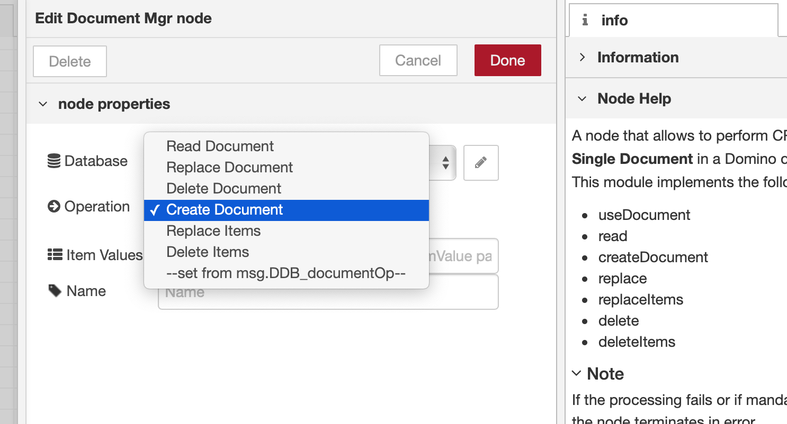\
\
It is, also, possible to configure the node to delegate to the incoming
msg.DDB\_documentOp attribute the kind of operation to be performed.
This is useful when, in your flow, you may want to decide which type of
operation to perform based on the information that the flow is managing.

Read Document

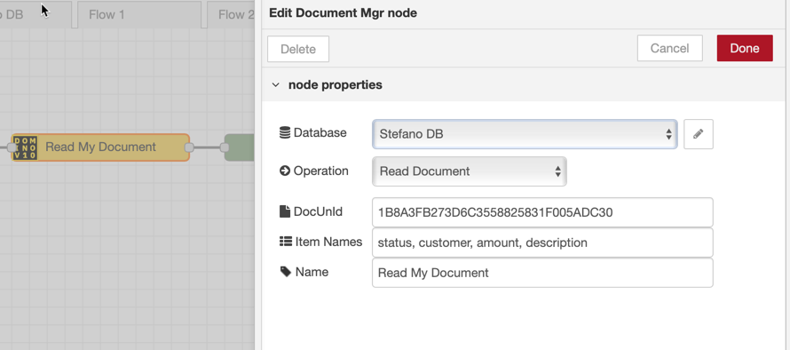

When selecting the **Read Document option**, you can specify a valid
**document id** (in the above picture 1B8A3FB273D6C3558825831F005ADC30 )
and the list of items (in the following picture status, customer,
amount, description as comma-separated items) to be retrieved.

-   The *DocUnid input* can be left empty in the editor. You can use the
    msg.DDB\_unid input attribute to provide the information at runtime.

-   The *Item Names input* can be left empty in the editor. You can use
    the msg.DDB\_itemNames input attribute (which is, also, a
    comma-separated list of unique ids) to provide the information at
    runtime

The output is represented here:

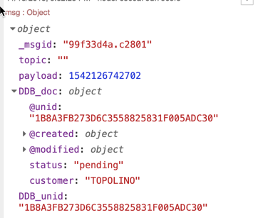

The msg.DDB\_doc is an object representing the document that has been
retrieved, including all the items you asked to retrieve.

The msg.DDB\_unid is the unique Id of the document that has been
retrieved.

##### Replace Document

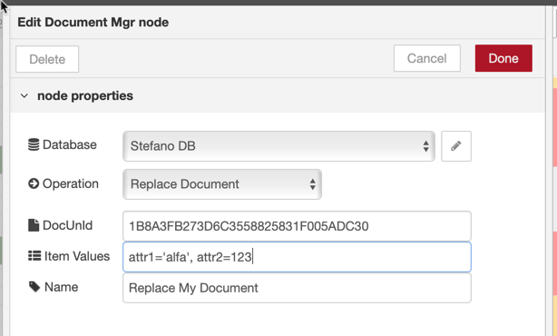

When selecting the **Replace Document option**, you can specify a valid
**document id** (in the above picture 1B8A3FB273D6C3558825831F005ADC30 )
and the comma-separated list of itemName/itemValues pairs (in the
following picture attr1=\'alfa\', attr2=123) to replace the existing
items for the selected Document.

-   The *DocUnid input* can be left empty in the editor. You can use the
    msg.DDB\_unid input attribute to provide the information at runtime.

-   The *Item Values input* can be left empty in the editor. You can use
    the msg.DDB\_itemValues input attribute. This attribute is an array
    of objects formatted in the following way:\
    

The output is represented here:

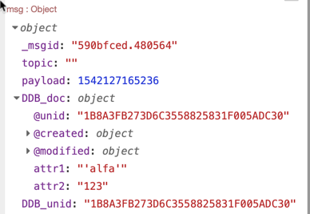

The msg.DDB\_doc is an object representing the document that has been
replaced, including all the items you asked to replace.

The msg.DDB\_unid is the unique Id of the document that has been
replaced.

##### Delete Document

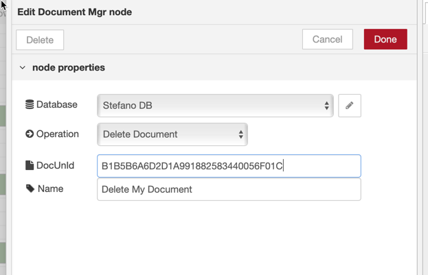

When selecting the **Delete Document option**, you can specify a valid
**document id** (in the above picture B1B5B6A6D2D1A991882583440056F01C).

-   The *DocUnid input* can be left empty in the editor. You can use the
    msg.DDB\_unid input attribute to provide the information at runtime.

The output is represented here:

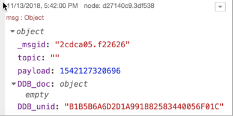

The msg.DDB\_doc is an empty object.

The msg.DDB\_unid is the unique Id of the document that has been
deleted.

##### Create Document

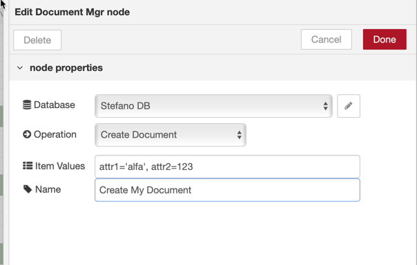

When selecting the **Create Document option**, you can specify a
comma-separated list of itemName/itemValues pairs (in the following
picture attr1=\'alfa\', attr2=123) to populate the newly created
Document.

-   The *Item Values input* can be left empty in the editor. You can use
    the msg.DDB\_itemValues input attribute. This attribute is an array
    of objects formatted in the following way:\
    

The output is represented here:

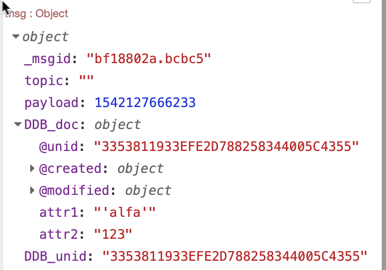

The msg.DDB\_doc is an object representing the document that has been
created, including all the items you asked to create.

The msg.DDB\_unid is the unique Id of the document that has been
created.

##### Replace Items

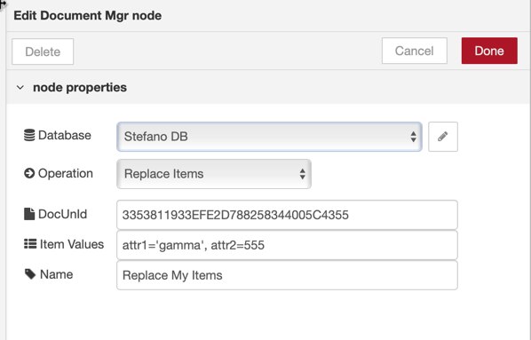

The behavior of this node is very similar to the one of the Replace
Document. The only difference is that the no new item is inserted but
items are modified\
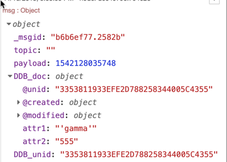

##### Delete Items

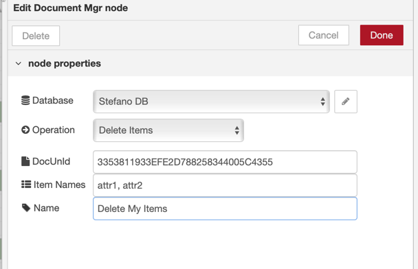

When selecting the **Delete Items option**, you can specify a
comma-separated list of item Names (in the following picture attr1,
attr2) to be removed from an existing Document.

-   The *Item Names input* can be left empty in the editor. You can use
    the msg.DDB\_itemNames input attribute (which is, also, a
    comma-separated list of unique ids) to provide the information at
    runtime

The output is represented here:

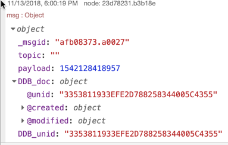

The msg.DDB\_doc is an object representing the document whose items have
been deleted.

The msg.DDB\_unid is the unique Id of the document whose items have been
deleted.

### Explain Query node

A node that **explains** a **Domino Query
Language** [query](https://www-01.ibm.com/support/docview.wss?uid=ibm10729047).
The node implements the explainQuery API.

Selecting the Domino Server and Database\
You can select the instance of your Domino Database using the
*Application selector*:\
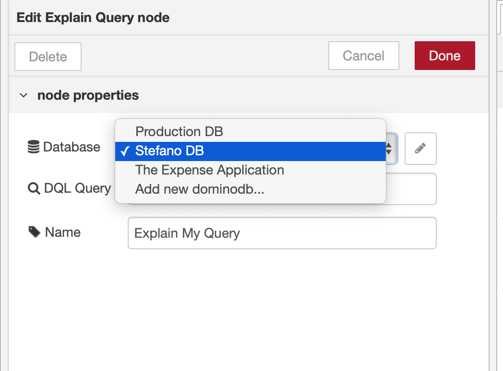\
This provides access to the library of **dominodb configurations**.

##### Explaining the Query

The node only accepts one input, the **DQL Query** to be explained:

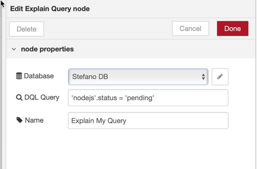

In the picture above, the DQL Query to be explained is represented by
the string \'nodejs\'.status = \'pending\' .

-   The *DQL Query input* can be left empty in the editor. You can use
    the msg.DDB\_query input attribute to provide the information at
    runtime.

##### Output

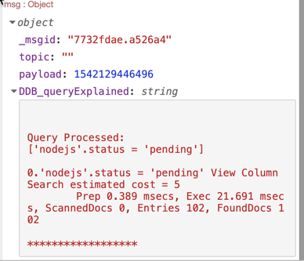

The msg.DDB\_queryExplained contains the output of the relevant API.

Error Handling
==============

**\
**If the processing fails or if mandatory inputs are missing, a
**node-red-contrib-dominodb** node terminates in error. \
The error object is the **incoming msg object** with the
additional msg.DDB\_fatal attribute representing the reason for the
error.

You can use a Node-RED **Catch Node** to catch the error.\
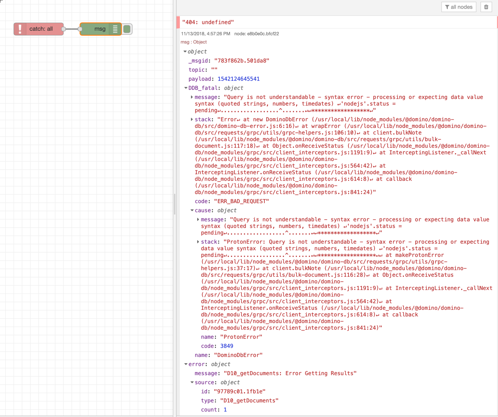
